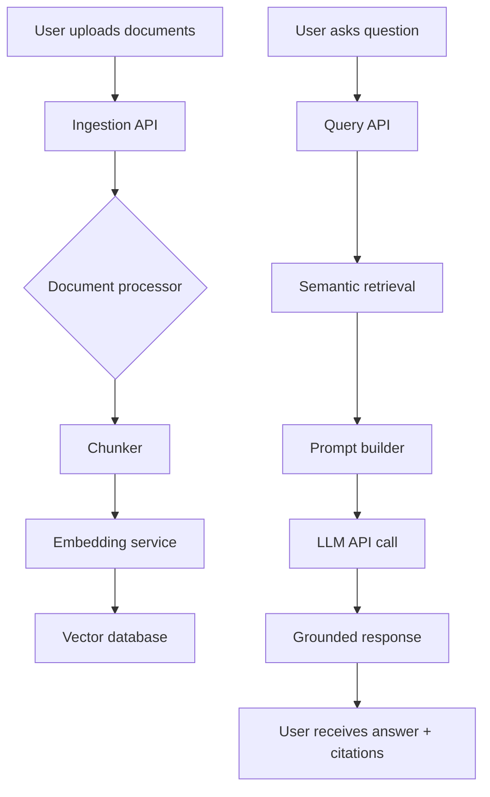

# RAG Architecture for Energy Document Intelligence

## Overview

This architecture is designed to provide a scalable, secure, and accurate question-answering experience over energy domain documents such as reports, manuals, and compliance guides.

## Core Components

1. **Document Ingestion Service**
   - Accepts PDF uploads through an API.
   - Extracts text and normalizes it into searchable content.
   - Generates document metadata for provenance and audit.

2. **Text Chunker**
   - Breaks large documents into smaller contextual passages.
   - Applies overlapping windows to preserve sentence continuity.
   - Stores chunk-level metadata such as page number and source filename.

3. **Embedding Service**
   - Converts each chunk into a dense vector using an LLM embedding model.
   - Maintains an embedding pipeline that is compatible with multiple providers.

4. **Vector Database**
   - Stores vector embeddings and metadata for fast semantic retrieval.
   - Supports high-performance retrieval and approximate nearest neighbors.
   - Can be exchanged with enterprise-grade vector stores.

5. **Retrieval Layer**
   - Searches the vector store for the top-k most relevant chunks.
   - Filters and ranks results by semantic similarity and document metadata.

6. **LLM Response Generator**
   - Builds a grounded prompt containing retrieved evidence.
   - Ensures the model answers only with information from the provided corpus.
   - Returns response text plus citations.

## Data Flow

## Deployment Considerations

- Use environment variables for keys and endpoint configuration.
- Persist vector store files to durable storage or swap in managed cloud vector DB.
- Secure API endpoints with authentication for production.
- Monitor query latency and indexing throughput.

## Grounding Strategy

- Restrict the LLM prompt to only use retrieved document excerpts.
- Provide explicit instructions to avoid hallucinations.
- Include source references from the vector store in each answer.

## Scalability

- Add horizontal ingestion workers for batch indexing.
- Use a dedicated vector database service for large-scale corpora.
- Cache frequent queries and reuse embeddings when documents are unchanged.
